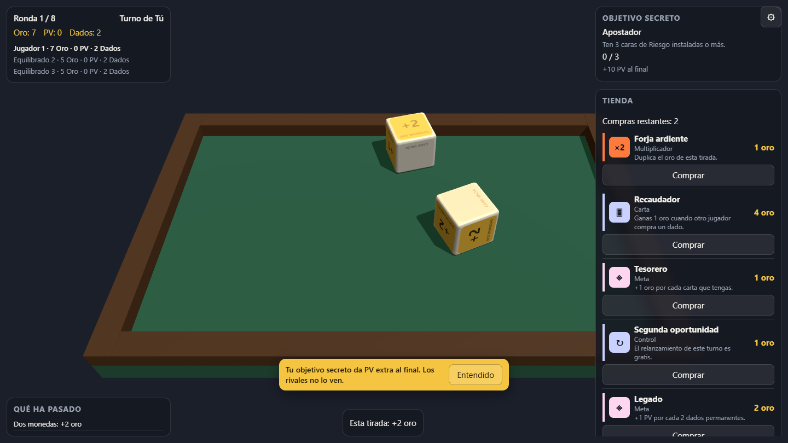

# Dice Foundry

Juego de estrategia ligero para navegador: lanza dados físicos, cobra oro y puntos, forja caras,
compra cartas y dados y cierra objetivos secretos en 8 rondas. Sin backend, sin registro, gratis.

**Jugar: https://dice-foundry.vercel.app**

Contra 1-3 bots (cinco arquetipos) o en hot-seat con hasta 4 humanos. La simulación decide el
resultado de cada tirada y la física solo lo representa: los dados nunca "roban" la partida.



## Desarrollo

```bash
npm install
npm run dev        # http://localhost:5173
npm run check      # lint + typecheck + tests (gate obligatorio antes de commitear)
npm run e2e        # Playwright (build + preview automáticos)
npm run test:all   # check + e2e
```

Parámetros útiles en la URL: `?seed=42&rounds=2&players=3&seats=human,casino,scorer&bots=instant`
(`bots` = `normal | fast | instant`), `?dev=scene` y `?dev=roll` para los bancos de pruebas.

## Simulador de balance

```bash
npm run sim -- --games 2000 --seats magnate,scorer,engineer,casino --rounds 8 --seed 1
```

Escribe `docs/balance/latest.md` (winrates, ítems, builds, umbrales). Los números del juego viven en
`src/core/data/*.ts`; cada cambio se anota en `docs/balance/CHANGELOG.md`.

## Deploy

```bash
npm run deploy     # vercel --prod --yes
```

Producción: https://dice-foundry.vercel.app (proyecto `adrian-ruedas-projects/dice-foundry`).
Cabeceras y caché en `vercel.json`. Para probar los e2e contra producción:

```bash
BASE_URL="https://dice-foundry.vercel.app" npx playwright test e2e/boot.spec.ts e2e/roll.spec.ts
```

### Pendiente de Adrian (opcional, nada bloquea)

- **Dominio propio** (`dice.adrianrueda.dev`): panel de Vercel → Settings → Domains.
- **Web Analytics**: panel de Vercel → Analytics → Enable (el `inject()` ya está en el código y
  solo se activa en producción, fuera de localhost).
- **Telemetría de producto**: crear proyecto gratuito en PostHog y añadir `VITE_POSTHOG_KEY` en las
  variables de entorno de Vercel. Sin clave no se envía nada. Ver `docs/telemetry.md`.
- **Playtest (fase 3 del diseño)**: 3 partidas completas y la checklist del documento de diseño §19.

## Documentación

- Reglas y catálogos: `docs/rules.md`
- Plan de implementación: `docs/superpowers/plans/2026-09-06-dice-foundry-mvp.md`
- Decisiones y desviaciones: `docs/DECISIONS.md`
- Balance: `docs/balance/latest.md`, `docs/balance/builds.md`, `docs/balance/CHANGELOG.md`
- Telemetría: `docs/telemetry.md`
- Diseño original: `D:/Proyectos/CONTROL/Proyectos/Activos/Dice Foundry/Diseño_original.md`

## Arquitectura

```
src/core/      reglas puras (sin DOM, sin three, sin rapier, sin Math.random)
src/physics/   Rapier: mesa, dados, pre-simulación determinista
src/render/    Three.js: escena, malla de dado, efectos, bucle de timestep fijo
src/ui/        HTML/CSS + TS vanilla, textos en src/ui/strings.es.ts
src/audio/     Web Audio sintetizado (sin assets)
src/app/       GameController: el único punto donde se tocan todas las capas
```
